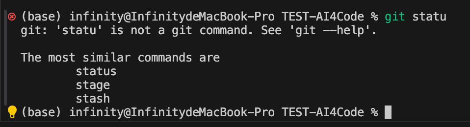
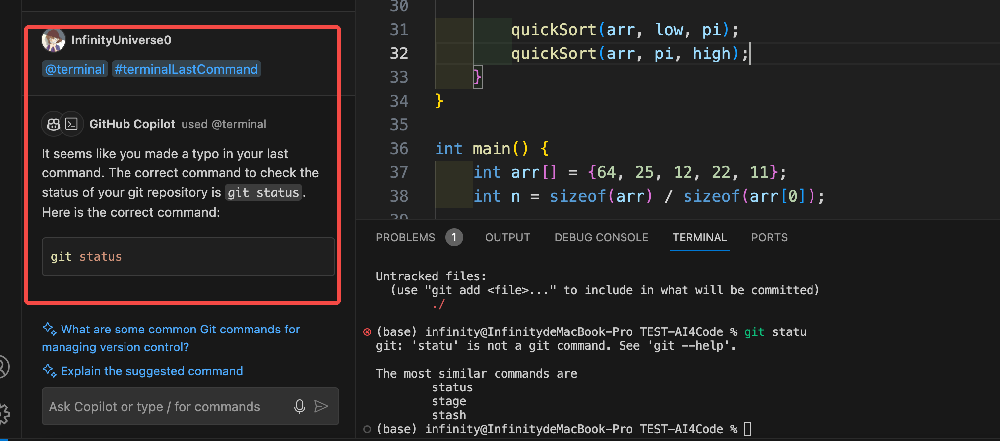

# AI4Code 调研报告

> 武桐西 2112515 信息安全

## 调研背景与调研内容

随着人工智能的发展，大模型特别是大语言模型（Large Language Models, LLMs）迅速崛起（代表性事件有OpenAI发布ChatGPT等），AI在编写代码方面也产生了一大批落地的应用，即AI4Code。

本次调研围绕 AI4Code 进行，调研市场上常见的 AI4Code 智慧编程工具。

## GitHub Copilot

- [官方网址](https://github.com/features/copilot)
- [官方文档](https://docs.github.com/en/copilot/about-github-copilot)

### 概述

GitHub Copilot 是 GitHub 推出的代码编写辅助工具，它基于LLM并在GitHub的开源仓库等代码上进行训练，具有非常好的代码编写与代码补全能力，同时将其集成在IDE中还可以进行聊天，能够解释代码、Debug以及生成单元测试、编写对应的文档等。

官方对其的介绍如下：

> GitHub Copilot 是一款 AI 编码助手，可帮助你更快、更省力地编写代码，从而将更多精力集中在问题解决和协作上。 Copilot 会在你键入时提供编码建议：有时是当前行的补全，有时是全新的代码块。 可以接受全部或部分建议，也可以忽略建议并继续键入。
>
> 使用聊天功能，可以询问 Copilot 解决问题的最佳方法。 或者，也可以要求 Copilot 解释其他人的代码。 如果你的代码有错误，可以询问 Copilot 如何修复它。

除此之外，GitHub Copilot的Enterprise版本提供更多的功能，如拉取请求摘要、Copilot知识库等，但由于其高昂的费用，因此*Enterprise的这些功能不在调研范围内*。

> 插一句：个人感觉Copilot这个名字起的挺有深意的，直译过来就是“副驾驶”，有种个人助手以及编程搭档的感觉。

### 获取 GitHub Copilot

GitHub Copilot是付费的，个人版每月10美元，但是可以通过申请GitHub学生包来免费使用（~~我是学生，送我～真香！~~）。

- GitHub Copilot可以在常用的IDE中使用；
- 也可以在命令行中通过 GitHub CLI 使用。

### 基本功能

#### 代码补全

新建一个 `quicksort.cpp` 文件，写上简单的注视告诉Copilot，在写上相关头文件后，可以看到Copilot会给出一段代码。

接受建议后，可以看到Copilot会继续给出与QuickSort相关的代码。

#### 代码生成

除了它的自动补全功能外，还可以通过自然语言直接要求Copilot生成你想要的代码。

#### 代码问答

可以要求GitHub Copilot对代码进行解释，可以依据给出的代码回答问题等。

一种比较简单的方式是直接光标选中对应的代码，然后选择Copilot的`Explain it` 即可调用Copilot Chat对选中代码进行解释。

不过需要注意的是，以这种方式生成的代码解释默认语言是英文。

也可以使用Copilot Chat，直接在聊天框中输入问题。

而且Copilot还会给出它所参考和引用的代码文件：

#### 注释生成

可以直接使用自然语言令Copilot生成注释。

也可以使用其内置命令 `/doc` 产生注释文档。

也可以使用Copilot Chat生成注释。

#### 代码测试

可以直接使用Copilot的内置命令 `/tests` 来生成代码的测试。

可以看到Copilot生成了对我指定的函数 `quickSort` 的测试文件，内容基本正确，但也有一些错误，比如没能引入相对应的函数头文件等。

### 其他亮点

#### Copilot Chat

> 如果Copilot能更像一个人一样，与你使用自然语言交互，那就更好不过了。

这不，在IDE的插件市场中还可以找到Copilot Chat，这个可以在你的IDE中集成一个聊天框，可以使用自然语言与Copilot聊天，让它提供建议、解释代码等。

功能类似于ChatGPT，只不过Copilot Chat主要是面向代码编程领域，而且无须“科学上网”（使用VPN）。

#### 猜你想问

> 俗话说的好，有时候问题往往比答案更重要。

Copilot Chat支持根据你的代码上下文以及聊天上下文，自动推荐你想问的问题。

#### 语音输入

近期，VSCode支持了语音输入，而GitHub Copilot也支持了语音聊天功能，可以进一步摆脱键盘交互，迈向更好的人机交互。

#### 代码修复

若代码中有一些错误，还可以让Copilot进行Debug。

比如下面这个例子，递归调用时需要谨慎处理边界：

可以看到Copilot给出了正确的代码修复建议。

也可以使用其内置命令 `/fix` 进行代码修复。

#### 命令行交互

Copilot也可以与命令行中的内容进行简单交互，虽然功能不如代码环境更加完善。

比如下面这个例子，命令行中使用命令时出错：

点击黄色灯泡💡，即可使用Copilot进行解释。

### 不同IDE下的体验

GitHub Copilot目前支持的IDE主要有 VScode、JetBrains系列以及Visual Studio 2022（其他版本目前不支持）等。

### VScode

前面的测试大部分是在VScode IDE中进行的，总体体验还可以，Copilot响应速度也比较快，感觉响应的流畅度在三个IDE中位列第一。

Copilot Chat的历史记录管理做的比较好，每次打开同一个项目时，会自动加载并恢复在该项目中的所有历史对话。

但是VScode中的Copilot Chat的代码上下文感知比较局限，比如：如果你选中一段代码并询问Copilot，它只能参考到你选择的代码，而不能获取相应的代码上下文。如下图所示：

### JetBrains

代码补全的响应速度和流畅度较好。

Copilot Chat的使用体验非常好，相比于其他两个IDE，JetBrains中的Copilot Chat能够自动感知当前项目的代码文件，自动选择（也可以手动选择）参考的代码文件和内容。

Chat的上下文关联度也非常好：

### VS2022

相较于前两个IDE，Copilot在VS2022中的代码补全响应较为迟钝，而且有时候触发比较困难，经常需要手动触发。

Copilot Chat的功能也不太完善，对中文语言的支持效果不是很好，整体效果远不及前两个IDE。

### 目标用户和需求分析

适合于企业的项目开发者、学生以及科研工作者。

- 对于项目开发者，Copilot可以生成常见的项目的大致工作流框架代码，开发者只需要检查并略加修改生成的代码即可，能够大幅度提高开发效率；

- 对于学生，Copilot可以生成非常高质量的代码，特别是在一些常见的被当作教学案例的代码场景下（这类代码在网络中的资源较多，因此Copilot训练时很可能“见过”这类代码），可以帮助学生生成运行效率高、代码简洁、风格规范的代码，比如某些经典的算法等。
- 对于科研工作者，Copilot可以帮助他们生成在科学研究中常用的代码逻辑，比如深度神经网络的训练代码等，让科研工作者将精力更多地投入到自己的研究中，而不是让其被繁琐的代码编写而拖累，从而加速科研效率。

### 总结与思考

#### 优点

1. 生成的代码的质量非常高，代码的上下文感知能力强；
2. 响应速度快，使用流畅；
3. 具备聊天功能（Copilot Chat），能够很好地进行代码问答，为开发提供建议等；
4. 支持的编程语言丰富；
5. 较高的代码修复能力；
6. 可以与IDE内的命令行进行简单交互；
7. 猜你想问功能、支持语音输入。

#### 缺点

1. 代码测试功能的可用性比较差；

2. 注释生成较为笼统，难以做到每一行代码对应一行注释；

3. 非GitHub学生包用户需要付费；

4. 训练时使用了GPL许可证的代码，因此如果将生成的代码商用可能会有一定法律风险。虽然可以通过开启 post-generation filters 过滤，但是这会影响其生成表现。

   

#### 改进建议

1. 改善Copilot在VS2022中的性能和表现；
2. 完善并改进代码测试功能，提高其可用性与准确性；
3. 生成的代码可能是在GPL等有特殊要求的许可证的开源仓库中的，可以在生成时提醒用户；或者干脆不生成这部分可能会使用户面临法律风险的代码。

## Codeium

[官方链接](https://codeium.com)

### 概述

Codeium是一款代码补全、代码生成AI助手，支持多种IDE，支持多种编程语言，同时具备代码聊天功能。

### 基本功能

#### 代码补全

在Codeium的补全过程中，可以明显的看出它的补全具有明显的层次结构性。具体而言，首先生成 `partition` 这个函数的大体架构（即前后大括号），然后在进一步生成里面更细致的内容；同样，生成 `for` 循环时也是类似的情形。

与此作为对比，GitHub Copilot 在生成代码时会按照序列的方式进行生成，比如生成函数时，先生成左大括号，再生成函数体，最后是右大括号。

个人猜测，这反映出两者在模型训练时的训练方式可能有所区别。

#### 代码生成

#### 代码问答

可以看到，Codeium可以感知代码上下文，并给出对代码的问答结果。

#### 注释生成

可以看到Codeium可以为代码生成关键注释。

从结果中也可以看到，生成的代码注释中包含一些数字水印内容（作者、日期等）。

除此之外，还可以让Codeium生成更加直白、更加通俗易懂的注释：

#### 代码测试

让Codeium针对 `quicksort.cpp` 中的 `partition` 函数生成单元测试，结果如下：

可以看到，Codeium较为出色地完成了代码的单元测试，并且测试的逻辑十分清晰，按照待测数组的大小进行针对性测试。

### 其他亮点

#### Chat 聊天

Codeium同样具备 Chat 聊天功能，该部分已在前面的测试中体现，这里不在赘述。

需要注意的是，有时Chat的回答并不十分准确，甚至没能给出可行的回答：

#### 代码库感知

Codeium可以自由选择要参考的代码库等文件，可以让对话以及代码问答等更加符合代码库上下文，从而获得更好的更高质量的回答。

#### Code Refactor

Codeium具有功能丰富的Code Refactor功能。

其支持的Code Refactor操作主要有：

- 添加注释和docstrings
- 添加登录信息以便debug
- 清楚代码
- 检查bug与空指针
- 实现TODE注释内容
- 生成单元测试
- 使该代码变为强数据类型
- 提高代码运行效率
- 通俗易懂的注释

例如，提高代码运行效率这一项，原始的代码为最简单的 `bubbleSort` ：

提高代码效率的结果如下：

可以看到，Codeium使用一个标志 `swapped` 来标记在一轮冒泡中是否发生了交换，若未发生交换则表明数组已经有序，便停止算法，从而提高了算法的运行效率。

#### Codeium Live

Codeium Live提供了一个浏览器的聊天界面，使得Codeium可以利用浏览器搜索一些代码库，进而使其相关知识始终处于最新，从而提高生成的代码质量和准确率。

以PyTorch库为例，可以选择与该库进行聊天，比如：

可以看到Codeium给出了回答，以及该回答所基于的代码上下文。

#### GPT-4

可以将GPT-4接入作为Base Model，以进一步提高自然语言理解能力以及代码的生成能力，提高代码质量。

不过该功能目前处于 closed beta 测试阶段，可以申请加入 waiting list（截至目前笔者仍未收到接收通知）。

### 不同IDE下的体验

#### VScode

上述测评主要基于 VScode IDE，这里不在赘述。

#### JetBrains

在 JetBrains 中使用与 VScode 中的体验基本一致，无太大差别。

### 目标用户和需求分析

适合于个人开发者以及个人科研工作者。

- 由于个人版是免费开放，因此相较于收费的Copilot，Codeium能够提供与Copilot类似的代码补全、代码生成、代码问答等功能，更适合个人开发者以及个人科研工作者。
- Codeium Live提供了时刻与最新的代码库保持一致更新的能力，适合于当某一第三方库有较大改动时，其他AI编程工具知识来不及更新，这是可以通过Codeium Live来与最新的第三方库对齐。

### 总结与思考

#### 优点

1. 较多的内置功能，如bug检测、单元测试、注释生成、优化代码执行效率等；
2. 优秀的代码库感知，可以手动添加代码库作为上下文参考；
3. Codeium Live时刻与最新代码库保持一致更新；
4. 支持多种编程语言；
5. 个人版完全免费；
6. 不在有法律风险的许可证的开源仓库训练，避免了用户将代码商用等会面临的法律风险。

#### 缺点

1. 代码生成速度较慢，且每次生成的代码内容较少；
2. 代码问答以及聊天系统生成的回答质量有时不高。

#### 改进建议

1. 提高代码生成以及代码补全的运行效率；
2. 生成代码时尽可能一次给出较多行代码；
3. 改进聊天系统的底层模型，提高代码问答质量，减少“幻觉”现象。

## 通义灵码

[官方链接](https://tongyi.aliyun.com/lingma/)

### 概述

通义灵码基于通义大模型，提供代码智能生成、研发智能问答能力，是国产（阿里）的AI编程助手。

### 基本功能

#### 代码补全

#### 代码生成

#### 代码问答

值得注意的是，对于聊天回答，通义灵码提供一些快捷选项，如重新回答、用英文回答、更宏观的回答、更细节的回答。

比如，点击 `In High Level` 之后，其生成的回答如下：

#### 注释生成

#### 代码测试

对 `partition` 函数生成单元测试，结果如下：

可以看到这段代码是使用Google Test框架为给定的`partition`函数编写的一组单元测试，从数组的元素的角度考虑一些边界情况对代码进行测试。

### 其他亮点

#### 原生的中文支持

由于通义大模型是国产模型，原生支持中文，因此更适合中国开发者的“体质”。

#### 问答系统具有生产环境开发支持

比如在向通义灵码提问 AES 加密的C++代码时，它的回答除了给出代码之外，还有一些生产开发的提示：

### 不同IDE下的体验

#### VScode

上面的测评以VScode IDE为主，这里不在赘述。

#### JetBrains

通义灵码在JetBrains中的表现和体验与VScode中的差别不大。

### 目标用户和需求分析

适合于中国的开发者和程序员。

- 由于通义灵码对于中文的原生支持，中国的开发者能够获得更好的开发体验；
- 同时通义灵码生成的代码更符合中国程序员的习惯。

### 总结与思考

#### 优点

1. 原生的中文支持；
2. 快速的代码生成与代码补全；
3. 问答系统具有生产环境开发支持，会考虑一些生产环境的安全问题。

#### 缺点

1. 生成的代码有时质量不高，经常出现多余但类似的语句。

#### 改进建议

1. 提高代码的上下文感知能力，生成更高质量的代码。

## AI4Code 新工具设计

如果我来开发一款新的智能辅助编程工具，我会采取以下形式进行开发，并设计以下功能：

1. **人机交互界面设计：** 设计直观友好的用户界面，支持多种操作方式，如键盘快捷键、鼠标操作和语音交互，提升用户体验和操作便捷性。

2. **智能代码补全与生成：** 实现智能代码补全功能，根据用户的编码习惯、项目语言和行业规范，提供准确、快速的代码补全建议，同时支持代码生成，快速生成常用代码模板和代码段。

3. **单元测试与代码覆盖：** 集成单元测试生成工具，根据用户编写的代码自动生成对应的单元测试代码，并提供代码覆盖率分析，帮助开发者确保代码质量和稳定性。

4. **代码规范检查与Linting：** 实现代码规范检查和Linting功能，识别代码中的潜在问题和违反规范的代码，提供改进建议，帮助开发者编写规范、可读性高的代码。

5. **智能注释生成与文档支持：** 提供智能注释生成功能，根据代码结构和逻辑自动生成注释，同时支持文档生成和管理，帮助开发者生成项目文档和API文档。

6. **定制化配置与扩展支持：** 提供个性化配置选项，允许用户根据自己的需求和偏好，定制化工具的功能和外观，并支持插件和扩展，增加工具的功能和灵活性。

这样设计的产品可以帮助开发者提高编码效率、质量和稳定性，同时支持单元测试、代码规范检查、注释生成等功能，提升代码质量和项目可维护性。

## 调研总结

本次调研总结了三种常用的AI4Code编程工具，比较了各自的优缺点。
