# <center>Combinational Logic Circuit Simulator</center>

<h2><center>软件工程第二次个人课程作业</center></h2>

> 武桐西 2112515 信息安全

## 总览

本次作业中，笔者使用 C++ 编程实现了一个组合逻辑电路的模拟器，能够按照题目给定的输入输出格式正确运行。笔者遵照一定的编程规范进行代码编写，考虑各种错误和异常处理，考虑项目的可扩展性，使用 CMake 进行项目构建，并进行静态代码分析检查、单元测试、性能分析（动态代码分析检查）与代码优化等。

## 一、题目要求

本次作业要求实现一个组合逻辑电路的简易模拟器，按照一定的格式要求进行输入输出。

除此之外，要求项目遵循一定的编程规范，考虑项目的可扩展性、错误和异常处理，并进行代码分析（包括静态分析和动态分析）、单元测试、性能分析与代码优化等。

## 二、项目结构与说明

本项目的目录结构如下：

```sh
.
├── CMakeLists.txt
├── bin
│   └── CombLogicSim # 可执行文件
├── include
│   ├── circuit.h
│   ├── config.h
│   ├── exception.h
│   ├── gates.h
│   └── utils.h
├── main.cpp # 主文件
├── test.cpp # 测试文件
└── src
    ├── circuit.cpp
    ├── gates.cpp
    └── utils.cpp
```

本项目使用 C++ 语言进行编写，使用 `CMake` 作为构建系统，使用 `CLion` 作为集成开发环境（IDE）。

### Quick Start

**Prerequisite**: Please make sure that you have installed `CMake` on your machine. If not, you need to install `CMake` first.

When you are in the same directory with this `README` file, run the below command in your terminal (bash, zsh, command line, or powershell):

```sh
cmake . -B build
cmake --build build
```

Or using **Release** Mode:

```sh
cmake . -B build -DCMAKE_BUILD_TYPE=Release
cmake --build build --config Release
```

Then, run the below command to execute the *Combinational Logic Circuit Simulator* program:

```sh
cd bin
./CombLogicSim
```

## 三、项目编程规范

### 编程规范

笔者参考多种流行的代码编程规范，并结合自己的个人习惯和项目编程经验，独创了一种新的编程规范。

本项目正是按照笔者自创的编程规范进行编写。

本项目使用的代码编程规范的主要约定有：

#### 1. 文件管理

1. 所有 C++ 头文件放置于主目录（主`CMakeLists.txt`文件所在目录）下的 `include` 目录下，便于统一集中管理。

   在 `CMakeLists.txt` 文件中添加如下一行，可以使得后续项目头文件的引入更加便捷：

   ```cmake
   target_include_directories(${PROJECT_NAME} PRIVATE ${CMAKE_CURRENT_SOURCE_DIR}/include)
   ```

2. 除了 `main.cpp` 和 `test.cpp` 之外，所有的 `.cpp` 源文件均放置于主目录（主`CMakeLists.txt`文件所在目录）下的 `src` 目录下，便于统一集中管理。

3. 在编写 `CMakeLists.txt` 文件时，加入如下命令：

    ```cmake
    set(EXECUTABLE_OUTPUT_PATH ${PROJECT_SOURCE_DIR}/bin)
    ```

    即可将编译并链接后生成的可执行文件于主目录（主`CMakeLists.txt`文件所在目录）下的 `bin` 目录下，简洁清晰。

4. 在项目构建时，将生成的构建文件统一放置于主目录（主`CMakeLists.txt`文件所在目录）下的 `build` 目录下，简洁清晰，便于管理。

#### 2. 命名规范

1. 文件名（ `.h` 与 `.cpp` ）采用纯小写字母命名。
2. 类名与函数名采用 PascalCase 约定（每个单词的首字母大写）。
3. 变量名采用 camelCase 驼峰命名法（首个单词的首字母小写，其他单词的首字母大写）。

#### 3. 注释规范

1. 类与函数的说明文档 docstring 采用多行多行注释的形式，如下图所示：

   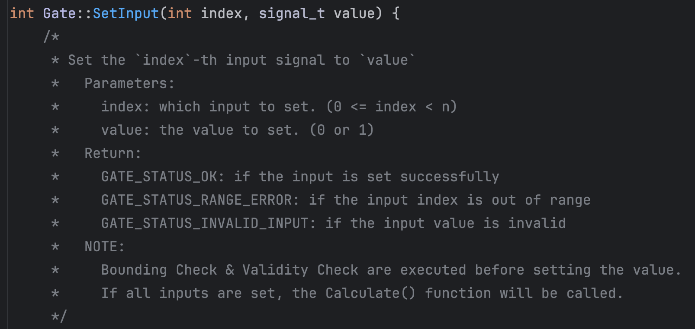

2. 其他说明性或思路性或警示注意性的注释采用单行注释，位于代码后或代码上下方；注释内容应简洁。

   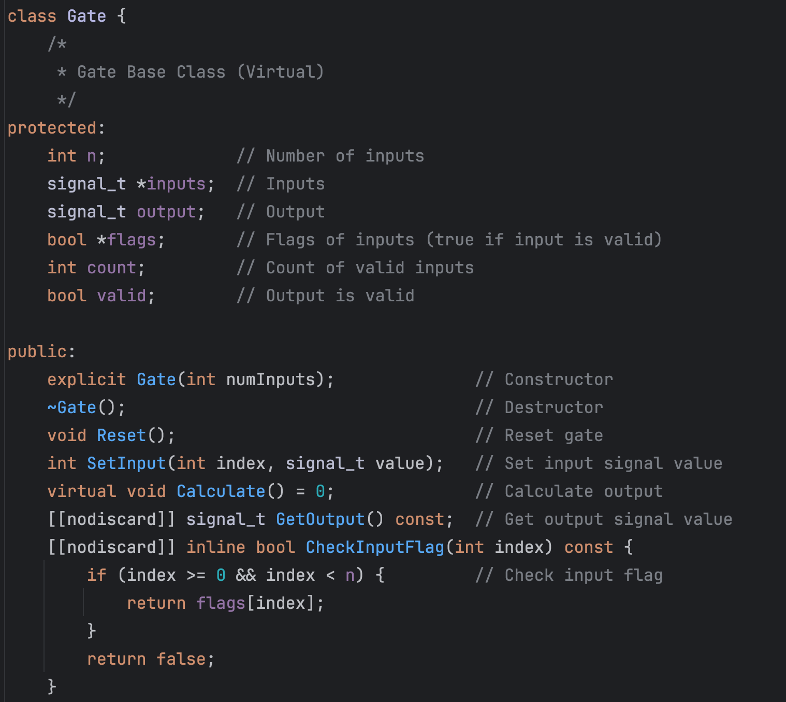

#### 4. 其他

1. 头文件引入时一般遵循内置头文件、第三方头文件、项目头文件的引入顺序。
2. 文件编码方式采用 UTF-8，并且所有字符均为可打印的 ASCII 字符。这意味着包括所有的注释都是采用 **英文** 书写。

### 静态代码分析

使用 Clang-Tidy 作为静态代码分析工具，对项目的代码进行静态分析。结果如下：

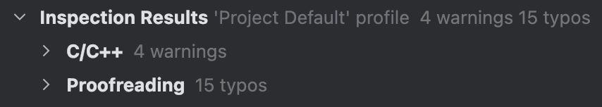

其中，Proofreading指的是文件的自然语言以及代码的标识符检查与校验（typos等），C/C++指的是代码的静态分析检查。

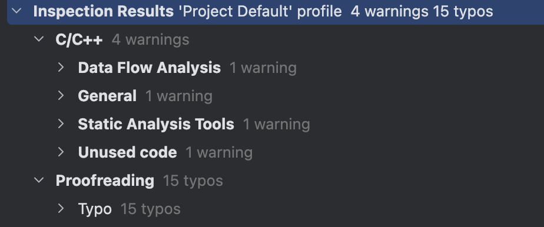

本项目中，Proofreading中出现了 15 个 typos，但是经过检查，发现均是一些专业术语或者术语的缩写等专有名词，因其未收录在该静态分析工具的字典中而发生了误报。比如：

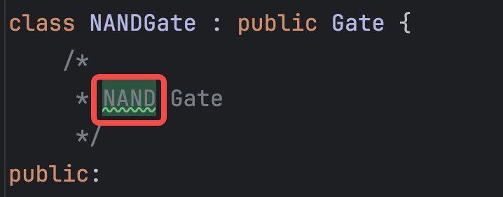

我们主要关注代码中检查出的问题：

#### 数据流分析

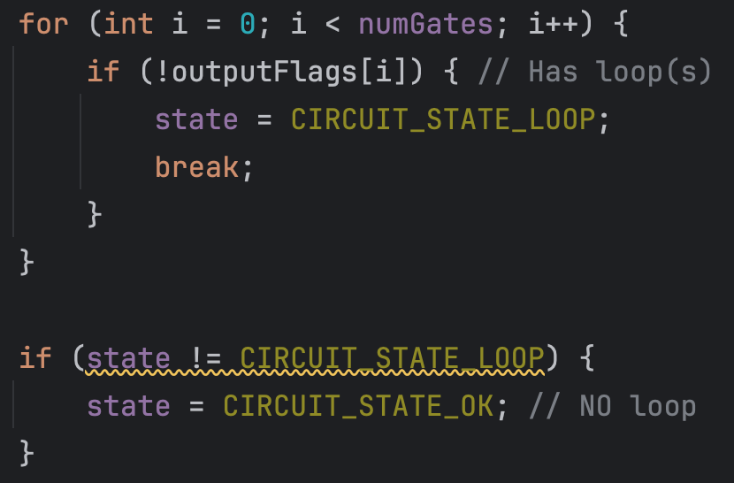

静态工具显示其问题为条件永真：

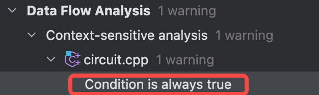

实际上，这应该是 Clang-Tidy 的**误报**，因为前面的代码中当电路存在环路时会导致有些逻辑门的输出标志位为 `False` ，因此会导致 `state` 变量的值被修改，因而并不会使得后面的 `if` 语句变为永真式，因而这属于静态分析工具的误报。

> 💡 从这里也可以看出静态分析工具存在的问题，这也是静态分析的难点和挑战所在。

#### 警告

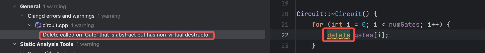

`gate[i]` 是一个抽象基类 `Gate` 的指针，这里实际上是利用了 C++ 的**多态性**，静态分析工具的警告是 `delete` 作用的对象是抽象基类并且其析构函数是非虚的。

虚析构函数是一种特殊的析构函数，它在基类中被声明为虚函数。当通过基类指针删除派生类对象时，如果基类的析构函数不是虚函数，那么就会只调用基类的析构函数，而不会调用派生类的析构函数，这可能会导致派生类的一些资源没有被正确释放，从而引发内存泄漏等问题。 

而在本项目的情境中，派生类相比于基类并没有额外的成员变量和成员函数，因此这里采用非虚的析构函数是**合理的**。

#### 静态分析工具的优化建议

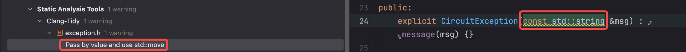

这里是编译器提示可以将 `std::string` 参数改为值传递同时使用 `std::move` 进行值的移动。这里可以提高程序的运行速度，不过缺点是每次调用该函数时需要调用 `std::string` 的拷贝函数，最终性能可能差别不大。这里保持了原来的这种更加通用、更加常规的写法。

#### 未使用的代码或变量


这里是说，结构体的字段 `type` 虽然被赋值了但是并没有被使用过。这里实际上是出于后续项目的**可拓展性**的考虑，因而保留了这一字段，以便于以后项目的拓展维护。

## 四、项目实现思路及实现过程

本项目中，主要编写了两个 `class` ，一是作为电路中抽象出的逻辑门的概念的 抽象基类 `Gate` 及其派生的六种具体的逻辑门（AND、OR、NOT、XOR、NAND、NOR），另一个是作为组合逻辑电路的抽象的 `Circuit` 类。除此之外其实还有一个用于异常处理的类 `CircuitException` 。

### Gate 逻辑门类

抽象积累 `Gate` 的定义如下：

```c++
class Gate {
    /*
     * Gate Base Class (Virtual)
     */
protected:
    int n;             // Number of inputs
    signal_t *inputs;  // Inputs
    signal_t output;   // Output
    bool *flags;       // Flags of inputs (true if input is valid)
    int count;         // Count of valid inputs
    bool valid;        // Output is valid

public:
    explicit Gate(int numInputs);              // Constructor
    ~Gate();                                   // Destructor
    void Reset();                              // Reset gate
    int SetInput(int index, signal_t value);   // Set input signal value
    virtual void Calculate() = 0;              // Calculate output
    [[nodiscard]] signal_t GetOutput() const;  // Get output signal value
    [[nodiscard]] inline bool CheckInputFlag(int index) const {
        if (index >= 0 && index < n) {         // Check input flag
            return flags[index];
        }
        return false;
    }

    static bool CheckInputNum(int numInputs);  // Check number of inputs
};
```

其各成员变量以及成员函数的含义及用途如注释中所示。

> ⚠️ **注意**：这是一个抽象基类，不能使用其生成对应的对象。真正有用的逻辑门类继承自该抽象基类。

可以抽象出 AND、OR、NOT、XOR、NAND、NOR 这六种常用的逻辑门。每个子类需要重写各自的构造函数、计算输出结果的 `Calculate()` 函数（这在基类是一个纯虚函数）以及静态成员函数 `CheckInputNum(int numInputs)` 。具体这里不再赘述，详情请参考代码。

### Circuit 组合逻辑电路类

`Circuit` 类是本项目中最主要的类，其定义如下：

```c++
class Circuit {
    /*
     * Circuit Class
     */
    struct GateInfo {
        int type;           // Gate type
        int numInputs;      // Number of inputs
        std::string *pins;  // Pin names

        GateInfo() : type(-1), numInputs(0), pins(nullptr) {}
        ~GateInfo() {
            delete[] pins;
        }
    };

private:
    int numGates;           // Number of gates
    int numInputs;          // Number of inputs
    Gate **gates;           // Gates
    GateInfo *gateInfos;    // Gate information
    signal_t *inputs;       // Inputs
    bool *flags;            // Flags of inputs
    int state;              // Circuit State

public:
    explicit Circuit(int _numGates, int _numInputs);                         // Constructor
    ~Circuit();                                                              // Destructor
    void AddGate(int index, int type, int gateNumInputs, std::string *pins); // Add gate
    void SetInput(int index, signal_t value);                                // Set input signal value
    void Reset();                                                            // Reset circuit (only inputs)
    void Run();                                                              // Run the circuit
    [[nodiscard]] signal_t GetOutput(int index) const;                       // Get output signal value
    [[nodiscard]] inline int GetState() const {                              // Get circuit state
        return state;
    }
    [[nodiscard]] inline int GetNumGates() const {                           // Get number of gates
        return numGates;
    }
    [[nodiscard]] inline int GetNumInputs() const {                          // Get number of inputs
        return numInputs;
    }
};
```

其各成员变量和成员函数的含义及用法如注释所示。

#### 环路检测

这里面最重要的一步是检查整个电路是否存在环路。

环路检测即检测该电路图是否是有向无环图（DAG），在算法实现方面，可以采用类似 **拓扑排序** 的思想。

```c++
// Run the circuit and check loop (using Topological Sort)
bool changed = true;
bool *outputFlags = new bool[numGates] {false}; // All elements are false

while (changed) {
    changed = false;

    for (int i = 0; i < numGates; i++) {
        if (gates[i]->GetOutput() != GATE_STATUS_INVALID_OUTPUT) {
            outputFlags[i] = true;
            continue;
        }

        for (int j = 0; j < gateInfos[i].numInputs; j++) {
            // Check input flag
            if (gates[i]->CheckInputFlag(j)) {
                continue;
            }

            if (gateInfos[i].pins[j][0] == 'I') {
                int inputIndex = std::stoi(gateInfos[i].pins[j].substr(1));
                inputIndex--; // 1-based to 0-based

                if (inputIndex < 0 || inputIndex >= numInputs) {
                    state = CIRCUIT_STATE_ERROR;
                    throw CircuitException(CIRCUIT_EXCEPTION_INDEX_OUT_OF_RANGE);
                }

                int statusCode = gates[i]->SetInput(j, inputs[inputIndex]);
                if (statusCode != GATE_STATUS_OK) {
                    state = CIRCUIT_STATE_ERROR;
                    if (statusCode == GATE_STATUS_RANGE_ERROR) {
                        throw CircuitException(CIRCUIT_EXCEPTION_INDEX_OUT_OF_RANGE);
                    } else if (statusCode == GATE_STATUS_INVALID_INPUT) {
                        throw CircuitException(CIRCUIT_EXCEPTION_INVALID_INPUT);
                    } else {
                        throw CircuitException(CIRCUIT_EXCEPTION_RUNTIME_ERROR);
                    }
                }

                changed = true;
            } else { // gateInfos[i].pins[j][0] == 'O' ⚠️这里在前面的过程中已经检验过pins[j][0]必为'I'或'O'
                int outputIndex = std::stoi(gateInfos[i].pins[j].substr(1));
                outputIndex--; // 1-based to 0-based

                if (outputIndex < 0 || outputIndex >= numGates) {
                    state = CIRCUIT_STATE_ERROR;
                    throw CircuitException(CIRCUIT_EXCEPTION_INDEX_OUT_OF_RANGE);
                }

                signal_t gateOutput = gates[outputIndex]->GetOutput();
                if (gateOutput != GATE_STATUS_INVALID_OUTPUT) {
                    int statusCode = gates[i]->SetInput(j, gateOutput);
                    if (statusCode != GATE_STATUS_OK) {
                        state = CIRCUIT_STATE_ERROR;
                        if (statusCode == GATE_STATUS_RANGE_ERROR) {
                            throw CircuitException(CIRCUIT_EXCEPTION_INDEX_OUT_OF_RANGE);
                        } else if (statusCode == GATE_STATUS_INVALID_INPUT) {
                            throw CircuitException(CIRCUIT_EXCEPTION_INVALID_INPUT);
                        } else {
                            throw CircuitException(CIRCUIT_EXCEPTION_RUNTIME_ERROR);
                        }
                    }

                    changed = true;
                }
            }
        }
    }
}

for (int i = 0; i < numGates; i++) {
    if (!outputFlags[i]) { // Has loop(s)
        state = CIRCUIT_STATE_LOOP;
        break;
    }
}

if (state != CIRCUIT_STATE_LOOP) {
    state = CIRCUIT_STATE_OK; // NO loop
}

delete[] outputFlags;
```

### 相关配置与宏定义

项目的相关配置信息和主要的宏定义放在 `config.h` 头文件中，如下所示：

```c++
// Configurations

#ifndef COMBLOGICSIM_CONFIG_H
#define COMBLOGICSIM_CONFIG_H

typedef int signal_t; // Define signal type

// Specifications
#define MAX_GATES_NUM 512 // Maximum number of gates
#define MAX_INPUTS_NUM 64 // Maximum number of inputs
#define MAX_RUN_CYCLES 1024 // Maximum number of run cycles

#define LOOP_ERROR_MSG "LOOP" // Loop error message

#endif //COMBLOGICSIM_CONFIG_H

```

其中，将 `int` 类型重新定义为一个新的类型 `signal_t` 主要是出于可拓展性和维护性角度。

例如，为节约内存可以很方便的将 `signal_t` 替换为 `int8` （即 `signed char` ）等；除此之外，这一操作也便于兼容性，在有些不支持某些类型的机器上可以很方便的维护和迁移，增加了其通用型=性。

> ⚠️ **注意**：这里之所以不适用 8-bit 的变量以节约内存，是出于性能的考虑；由于现在的机器的位宽一般都是 64 位或 32 位（现在一般也很少见了），因此考虑按位宽对齐可以提高程序性能。

### CircuitException 异常处理类

为方便异常处理，编写异常处理类，如下：

```c++
#include <exception>
#include <string>

// Circuit Exception
#define CIRCUIT_EXCEPTION_INDEX_OUT_OF_RANGE "Circuit Exception: Index out of range"
#define CIRCUIT_EXCEPTION_GATE_TYPE_ERROR "Circuit Exception: Gate type error"
#define CIRCUIT_EXCEPTION_INVALID_INPUT "Circuit Exception: Invalid input"
#define CIRCUIT_EXCEPTION_RUNTIME_ERROR "Circuit Exception: Runtime error"
#define CIRCUIT_EXCEPTION_VALUE_RESET_WARNING "Circuit Exception: Value reset warning"

class CircuitException : public std::exception {
    /*
     * Circuit Exception
     */
private:
    std::string message; // Exception message

public:
    explicit CircuitException(const std::string &msg) : message(msg) {}

    [[nodiscard]] const char *what() const noexcept override {
        return message.c_str();
    }
};
```

首先，定义一些异常的提示信息，随后编写 `CircuitException` 继承自 `exception` 类，并重载构造函数和 `what()` 函数。

注意，这里需要引入 `exception` 头文件。

之后，便可以在类 `Circuit` 中以及后续的 `main` 函数中使用了。

部分异常处理的使用如下：

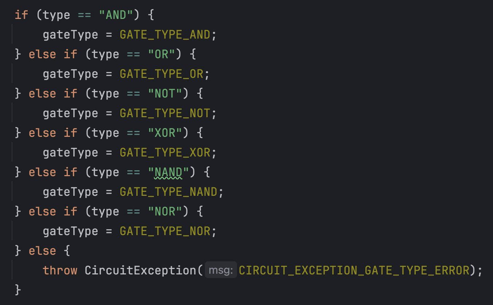

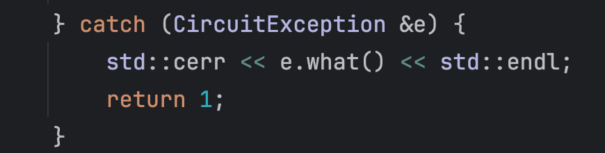

> 具体的异常处理内容见代码，这里不再赘述。

### utils

为方便对 `Circuit` 类的利用，同时也为了减少 `main` 函数中的代码，使其更加简洁，故编写 `utils` 文件。

这里面主要定义了两个函数：

```c++
// Gate Initialization from standard input
void GateInit(Circuit &circuit);

// Input Initialization
void InputInit(Circuit &circuit, signal_t *inputs, int numInputs);
```

- `GateInit`：实现从标准输入中读取相关数据并用于初始化 `Circuit` 类的对象的所有逻辑门及其连接关系，相当于初始化整个组合逻辑电路。
- `InputInit`：实现从数组中初始化输入信号值。

### main

最后，编写 `main` 函数，这也是整个程序的入口点，用于按照输入格式要求读取数据并进行计算后按照输出格式要求进行输出。

这里面主要的内容是对标准输入流的解析。

```c++
// main

#include <iostream>
#include "config.h"
#include "exception.h"
#include "circuit.h"
#include "utils.h"

int main() {
    int query; // Number of queries
    std::cin >> query;
    if (query < 1) {
        std::cerr << "Invalid query number" << std::endl;
        return 1;
    }

    int numInputs, numGates;
    std::cin >> numInputs >> numGates;
    if (numGates < 1 || numGates > MAX_GATES_NUM || numInputs < 0 || (numInputs > MAX_INPUTS_NUM * numGates)) {
        std::cerr << "Invalid input number or gate number" << std::endl;
        std::cerr << "0 <= numInputs <= " << MAX_INPUTS_NUM * numGates << std::endl;
        std::cerr << "1 <= numGates <= " << MAX_GATES_NUM << std::endl;
        std::cerr << "Got Input number: " << numInputs << ", Got Gate number: " << numGates << std::endl;
        return 1;
    }

    for (int i = 0; i < query; i++) { // For each query
        Circuit circuit(numGates, numInputs);
        int runTimes; // Number of runs
        try {
            GateInit(circuit);

            std::cin >> runTimes;
            if (runTimes < 1 || runTimes > MAX_RUN_CYCLES) {
                std::cerr << "Invalid run number" << std::endl;
                std::cerr << "1 <= runTimes <= " << MAX_RUN_CYCLES << std::endl;
                std::cerr << "Got runTimes: " << runTimes << std::endl;
            }

            auto **inputs = new signal_t *[runTimes]; // Input value array
            auto **outputIndex = new int *[runTimes]; // Output index array
            auto *outputNum = new int[runTimes]; // Output number array
            for (int j = 0; j < runTimes; j++) { // Read inputs
                inputs[j] = new int[numInputs];
                for (int k = 0; k < numInputs; k++) {
                    std::cin >> inputs[j][k];
                }
            }
            for (int j = 0; j < runTimes; j++) { // Read output index
                std::cin >> outputNum[j];
                outputIndex[j] = new int[outputNum[j]];
                for (int k = 0; k < outputNum[j]; k++) {
                    std::cin >> outputIndex[j][k];
                    outputIndex[j][k]--; // 1-based to 0-based
                }
            }

            auto **outputs = new int *[runTimes]; // Output value array
            auto *flags = new bool[runTimes]; // Output flag array

            for (int j = 0; j < runTimes; j++) { // For each run
                InputInit(circuit, inputs[j], numInputs);
                outputs[j] = new int[outputNum[j]];
                circuit.Run();
                if (circuit.GetState() == CIRCUIT_STATE_OK) {
                    flags[j] = true;
                    for (int k = 0; k < outputNum[j]; k++) {
                        outputs[j][k] = circuit.GetOutput(outputIndex[j][k]);
                    }
                } else {
                    flags[j] = false;
                }
            }

            // Print
            for (int j = 0; j < runTimes; j++) {
                if (flags[j]) {
                    for (int k = 0; k < outputNum[j]; k++) {
                        if (k > 0) {
                            std::cout << " ";
                        }
                        std::cout << outputs[j][k];
                    }
                } else {
                    std::cout << LOOP_ERROR_MSG;
                }
                std::cout << std::endl;

                delete[] inputs[j];
                delete[] outputIndex[j];
                delete[] outputs[j];
            }

            delete[] inputs;
            delete[] outputIndex;
            delete[] outputNum;
            delete[] outputs;
            delete[] flags;
        } catch (CircuitException &e) {
            std::cerr << e.what() << std::endl;
            return 1;
        }
    }
    return 0;
}
```

## 五、项目可拓展性

> 在本报告的行文过程中，已经穿插了一些项目可拓展性的考虑说明。这里再补充一部分。详细内容请参考代码。

定义一些逻辑门电路的类型代码，目前已经支持 AND、OR、NOT、XOR、NAND、NOR 这六种逻辑门，以后可以继续继承基类 `Gate` ，并按照递增顺序编写逻辑门的类型代码，以便后续的拓展。

初次之外，逻辑门电路的状态代码也可以根据需要继续增加。

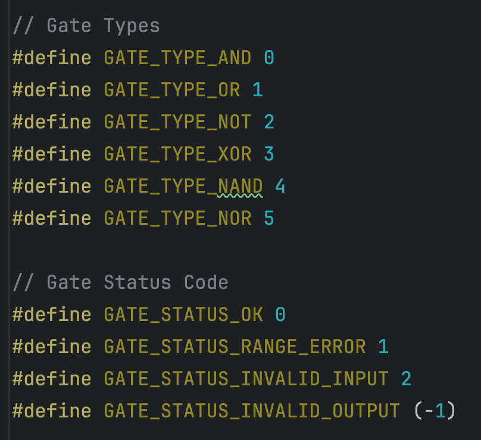

其他可拓展性的考虑不再单独举例，详情参见代码。

## 六、单元测试

使用 Google Test 进行单元测试，以 `Circuit` 类为例，编写单元测试文件，如下：

```c++
#include <gtest/gtest.h>
#include "circuit.h"

class CircuitTest : public ::testing::Test {
protected:
    Circuit* circuit;

    void SetUp() override {
        circuit = new Circuit(5, 3);
    }

    void TearDown() override {
        delete circuit;
    }
};

TEST_F(CircuitTest, Constructor) {
    EXPECT_EQ(circuit->GetNumGates(), 5);
    EXPECT_EQ(circuit->GetNumInputs(), 3);
    EXPECT_EQ(circuit->GetState(), CIRCUIT_STATE_WAIT);
}

TEST_F(CircuitTest, AddGate) {
    std::string pins[2] = {"I1", "I2"};
    circuit->AddGate(0, GATE_TYPE_AND, 2, pins);
    // Add assertions to verify the gate was added correctly
}

TEST_F(CircuitTest, SetInput) {
    circuit->SetInput(0, 1);
    // Add assertions to verify the input was set correctly
}

TEST_F(CircuitTest, Reset) {
    circuit->Reset();
    // Add assertions to verify the circuit was reset correctly
}

TEST_F(CircuitTest, Run) {
    // Setup the circuit
    circuit->Run();
    // Add assertions to verify the circuit ran correctly
}

TEST_F(CircuitTest, GetOutput) {
    // Setup the circuit
    circuit->Run();
    signal_t output = circuit->GetOutput(0);
    // Add assertions to verify the output is as expected
}

int main(int argc, char **argv) {
    ::testing::InitGoogleTest(&argc, argv);
    return RUN_ALL_TESTS();
}

```

运行后发现可以通过所有的测试样例。

除此之外，使用 Varlgrind 工具进行内存泄漏的检查。

分析结果表明本项目没有内存泄漏的情况。

## 七、性能分析与代码优化

### 性能分析

使用 CLion 内置的性能分析工具 Profiler 进行性能分析。

程序的输入为：

```sh
1
3 5
XOR 2 I1 I2
XOR 2 O1 I3
AND 2 O1 I3
AND 2 I1 I2
OR 2 O3 O4
4
0 1 1
1 0 1
1 1 1
0 0 0
2 5 2
2 5 2
2 5 2
2 5 2
```

程序性能分析的结果如下：

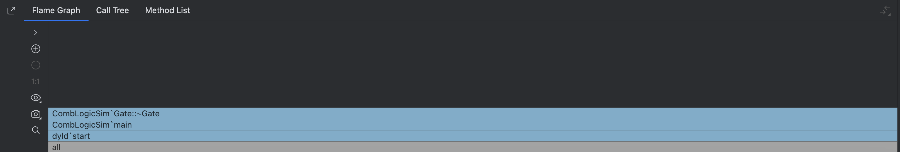

受限于该工具本身的局限性，其结果展示比较简略，并且似乎忽略了很多函数。

从理论上分析可知，除了 I/O 操作会相对耗时之外，最影响程序运行时间的关键代码位于整个电路的运行函数 `Circuit::Run()` ，而 程序的 I/O 消耗已无法轻松地进一步优化，因此程序的性能瓶颈主要在于电路的运行函数 `Circuit::Run()` ，并且其中消耗时间最大的部分是 **拓扑排序** 的循环（在这里一边计算一边判断图是否有环）。

### 算法复杂度与代码优化

根据前面的分析，本项目程序的主要性能瓶颈在于 **拓扑排序** 部分，在这一部分中，会对每个逻辑门进行循环遍历，直至一轮遍历中所有的逻辑门的输入输出均没有发生更新时停止循环，在这个过程中会不断计算当前可以计算的逻辑门的输入和输出，在循环结束后，若所有逻辑门的输出标志位均为有效，则此电路图是有向无环图，否则电路中存在环路。

具体的算法复杂度依赖于电路的结构。

在这一部分，代码的优化已被考虑，通过一些提前的判断可以提前结束本轮循环并进入下一轮，从而提高程序性能。

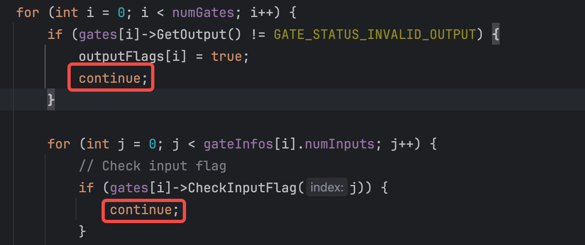

## 八、总结与思考

本次作业中，笔者按照软件工程的思想，使用 C++ 编程实现了一个组合逻辑电路的模拟器，能够按照题目给定的输入输出格式正确运行。

笔者遵照一定的编程规范进行代码编写，考虑各种错误和异常处理，考虑项目的可扩展性，使用 CMake 进行项目构建，并进行静态代码分析检查、单元测试、性能分析（动态代码分析检查）与代码优化等。

笔者将自己在软件工程课程中的所学理论应用于本次项目实践，构建了一个相对完整的 **组合逻辑电路模拟器**，收获颇丰！